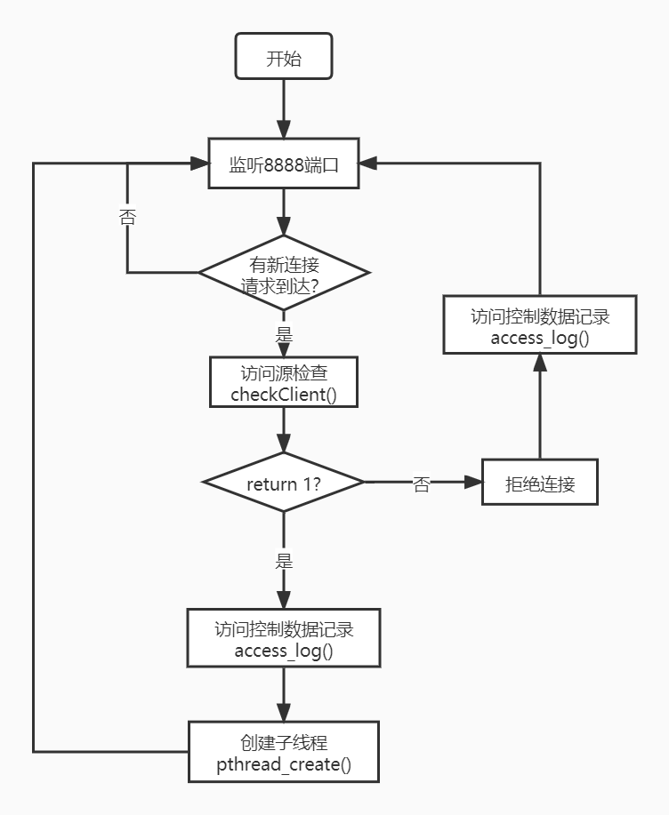
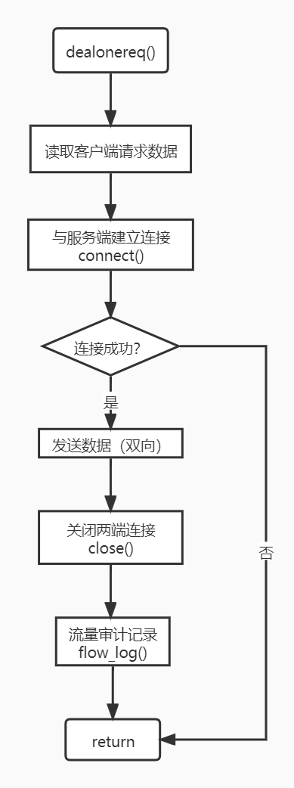

# Proxy

```
gcc -o proxy proxy.c -lpthread -lsqlite3
./proxy 8888
```

注意需要安装`sqlite3`。

## 基本访问连接

相较于原型系统，改动的函数有：
- `print_clientinfo()`；
- `print_serverinfo()`；
- `connect()` 将`strcpy(newhostname, hostname)`改成了`strcpy(newhostname, lastservername)`；
- `lastservername = "192.168.33.1:80"`，实际的内网服务器IP，注意要带上端口号；
- `lastserverip = 1`；
- `checkclient()`写了一个简单的拒绝访问功能，可以设置一个拒绝访问的IP；
- 注：`checkserver()`没写，感觉不需要这个功能。

至此，外网客户可以访问到内网的HTTP服务了。
运行时终端输出如下：
```
test@ubuntu:~/workspace$ ./proxy -p 8888
Welcome to attend the experiments of designing a proxy firewall! 
Received a request from 192.168.98.1, port 1024
Check client...
Received a request from 192.168.98.1, port 15826
Check client...
HTTP server: 192.168.33.1, port 80
```

## 审计数据库模式

**数据库：sqlite3**，`log.db`

目前支持以下两个数据表的记录功能。

- 访问控制日志（入站）对应 table：`access`

  |访问时间|访问源|源端口|访问目标|目的端口|协议|策略|
  |---|--|---|--|--|--|--|
  |time|srcIP|srcPort|destIP|destPort|protocol|policy|
  |TEXT|TEXT|int|TEXT|int|TEXT|int|


- 流量日志（入站/出站）对应 table：`flow`
  |连接时间|断开时间|访问源|源端口|访问目标|目的端口|协议|入站字节数|入站报文数|出站字节数|出站报文数|
  |---|--|---|--|--|--|--|--|--|--|--|
  |open|close|srcIP|srcPort|destIP|destPort|protocol|inPackets|inBytes|outPackets|outBytes|
  |TEXT|TEXT|TEXT|int|TEXT|int|TEXT|int|int|int|int|

## 审计功能模块

- 修改了`main()`和`dealonereq()`函数；
- 访问记录函数`access_log()`
- 流量记录函数`flow_log()`

## 程序流程图

主程序流程图：


子线程函数`dealonereq()`流程图：
